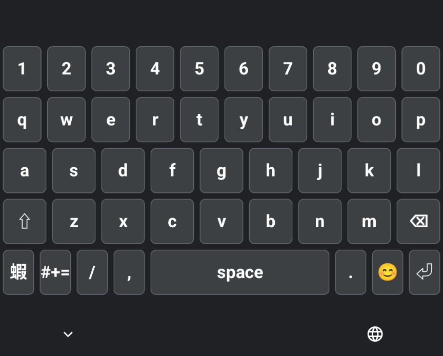
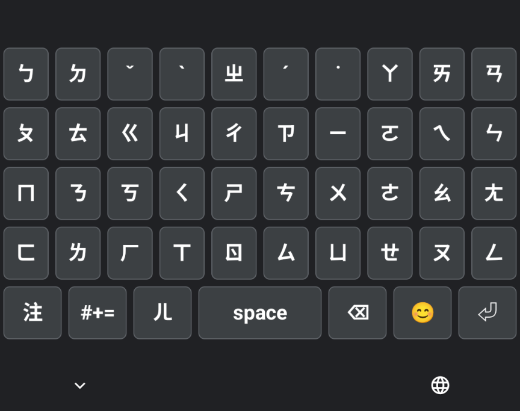
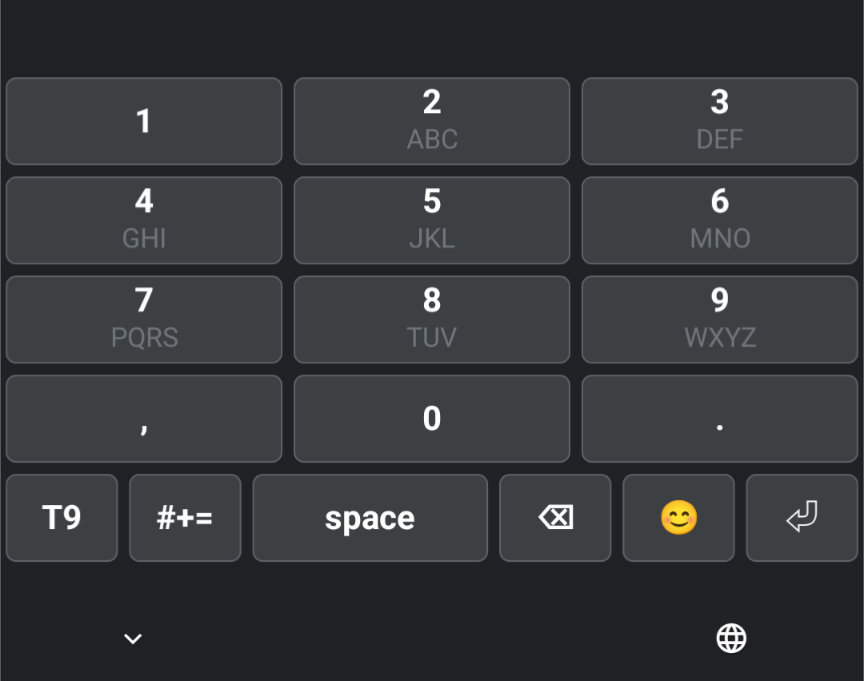
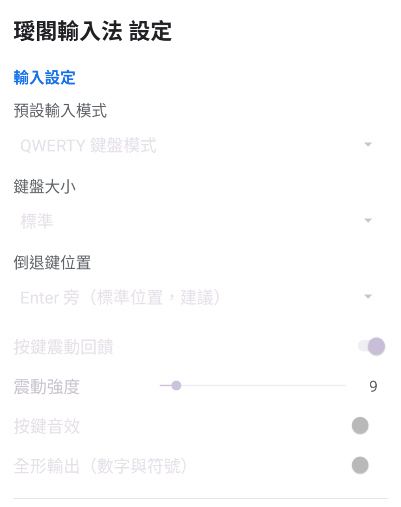
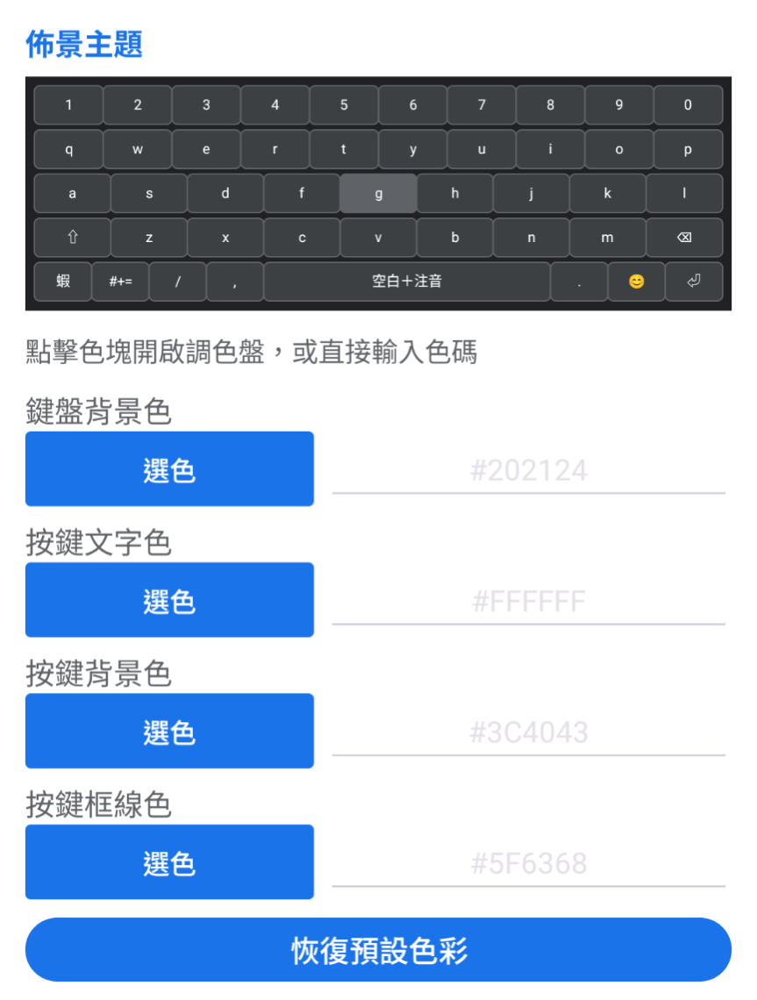
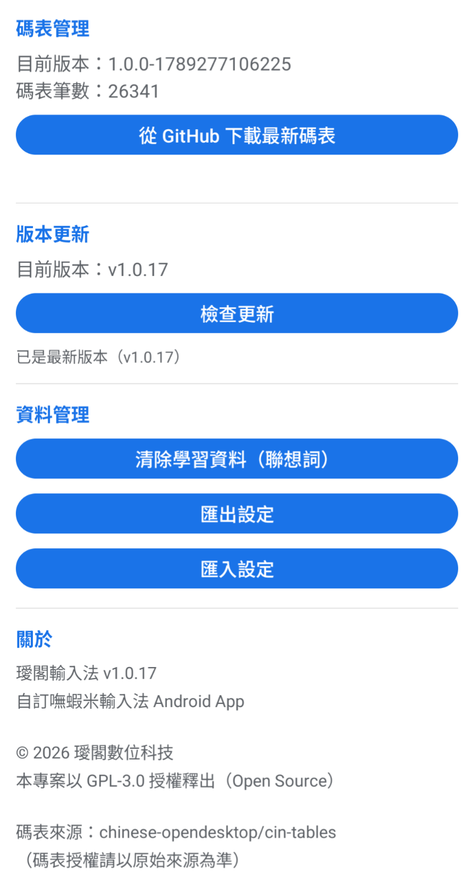

# 璦閣輸入法（BoshiamyIME）

> 純 Kotlin、完全離線的 Android 嘸蝦米輸入法。
> 你的輸入是你的，**字根不上傳、足跡不留下**——GPL-3.0 開放原始碼，給有緣人自由使用、研究與改進。

## 截圖

實機畫面（v1.0.18，Android）：

<p align="center">
  
  
  
</p>
<p align="center">
  
  
  
</p>

---

## 功能特色

| 項目 | 說明 |
|---|---|
| 🎹 鍵盤模式 | 標準嘸蝦米 / 注音（依字頻排序）/ T9 預測 / QWERTY 英文 |
| 🔣 額外面板 | 符號面板、表情符號（Emoji）面板 |
| 🧠 聯想詞 | 內建 1 萬+ 鍵、11 萬+ 詞條聯想，**並於輸入時自動學習**新詞；注音輸入時自動結合成雙字詞（如 ㄨㄢㄕㄤ →「晚上」），越用越準 |
| 🕶️ 主題 | 跟隨系統深色／自訂色彩（背景、文字、按鍵、框線，`#RRGGBB` 色碼） |
| 🎨 鍵盤大小 | 0.7×–1.4× 縮放，大螢幕小螢幕都好按 |
| 🔂 輸出控制 | 數字／符號可切換全形輸出；打出字後**空間鍵顯示該字的蝦米字根**（邊打邊學會拆碼） |
| 📦 資料管理 | 清除自學記錄、設定**匯出／匯入**（JSON） |
| 🔌 回饋 | 按鍵震動／音效可獨立開關（抖音愛好者有福了）；倒退鍵位置可選（右上／頂排） |

---

## 隱私（輸入法該有的基本尊重）

**輸入法看得到你打的一切，這是權力也是責任。**

- 🚫 **完全離線運作**：拆字、組字、聯想、學習全部在本機，鍵盤輸入**絕不上傳**
- 🚫 **無廣告、無追蹤、無資料收集 SDK**（不掛 Firebase / 分析套件）
- 🌐 唯一的網路權限是「手動更新碼表」——按了「更新碼表」才會連 GitHub 下載，除此之外不會主動連網
- 🔏 開源即信任：**開源軟體沒有廚房門**，任何人都可以走進來看 code 到底做了什麼

---

## 鍵盤模式

1. **標準嘸蝦米（QWERTY 中文）**
   - 輸入嘸蝦米碼時於游標處即時組字
   - `Enter` 將目前組合提交為**英文**（保留大小寫與混合字）
   - `Space` 若為合法字碼 → 出字；否則顯示錯誤提示
   - 嘸蝦米碼維持小寫（含 `, . ' [ ]`）
   - `⇧` 單按＝一時英文大寫（按鍵轉藍）；**雙擊＝鎖定大寫 CapsLock**（按鍵轉綠）；長按＝直接送出該英文字元

2. **注音**
   - 依實際字頻排序候選，常用字優先；簡化字自動降權
   - **連打組詞**：連續輸入兩個音節自動組詞，ㄨㄢㄕㄤ（可不打聲調）→ 候選列直接出現「晚上」
   - **自動補聲調**：ㄨㄢ 自動帶 ㄨㄢˇ、ㄕㄤ 帶 ㄕㄤˋ，依字頻＋後接詞關聯找最佳組合
   - **完整音節後可續打**：ㄨㄢˇ ㄕㄤˋ（含聲調）也能繼續連打，不必重開
   - `Space`＝直接送出候選列第一項（詞或字）；真的無此字才顯示「查無此字」並清空
   - 打出的雙字詞會**記入個人關聯**，日後排序更貼近你的用語

3. **T9 預測**
   - 五列大按鍵佈局（`1 2 3 / 4 5 6 / 7 8 9 / , 0 .`）
   - 子標籤放大，減少誤觸（手大友善）
   - `Space` = 送出暫存後輸出空白；`Enter` = 換行／送出數字

4. **QWERTY 英文**
   - 直接輸出字母，保留大小寫（含 Shift 一次性切換與 CapsLock 鎖定）

> 模式切換：QWERTY 列左側 **`mode`** 鍵 以「T9 → QWERTY → 注音 → T9」循環（鍵上直接顯示目前模式名）；`#+=` 開符號面板、`😊` 開表情面板；QWERTY 頁另有 **`ABC`** 直切英文、**`✕`** 回上一面板。

---

## 開發環境與建置

| 項目 | 版本 |
|---|---|
| Min SDK | 24（Android 7.0） |
| Target / Compile SDK | 35 |
| Kotlin | 2.1.0 |
| AGP | 8.7.3 |
| Gradle | 9.7.1 |
| JDK | 17（**不要用 JDK 25，AGP lint 會崩**） |
| 依賴 | AndroidX Core / AppCompat / Material / ConstraintLayout / coroutines |

**Debug APK：**

```bash
export JAVA_HOME=/path/to/jdk-17
export PATH=$JAVA_HOME/bin:$PATH
export ANDROID_HOME=/path/to/Android/Sdk
./gradlew :app:assembleDebug
```

產出：`app/build/outputs/apk/debug/app-debug.apk`

**Release 簽署版：**

```bash
./gradlew :app:assembleRelease
# 產生正式簽名（只需做一次，keystore 請高規格備份）
keytool -genkeypair -keystore boshiamy-release.keystore -alias boshiamy \
        -keyalg RSA -keysize 2048 -validity 10000 \
        -dname "CN=IgG Digital Technology, O=IgG, C=TW"
# 簽署
apksigner sign --ks boshiamy-release.keystore --ks-key-alias boshiamy \
        --out app-release-signed.apk app/build/outputs/apk/release/app-release.apk
```

已簽署的正式包：**每版發布於 GitHub Releases**（`https://github.com/Solo-man-IGG/IgG-BoshiamyIME/releases`），亦可於 `dist/` 找到歷版（`dist/` 不進 git）。

---

## 安裝與啟用

1. 下載 release APK（或自行建置 debug 版）安裝
2. 開啟系統 **設定 → 語言與輸入 → 鍵盤**，啟用「璦閣輸入法」
3. 於任何輸入框切換至「璦閣輸入法」即可使用

> ⚠️ 若之前裝的是 debug 版，升級到正式簽署版前請**先卸載**（簽章不同無法覆蓋，卸載會清掉自學資料）。

---

## 專案結構

```
app/src/main/
├── assets/tables/
│   ├── standard/dictionary.json     # 標準嘸蝦米字碼表
│   ├── standard/associations.json   # 聯想詞（1 萬+ 鍵）
│   └── zhuyin/dictionary.json       # 注音字典（含字頻）
├── java/tw/igg/boshiamyime/
│   ├── service/ BoshiamyInputMethodService.kt   # 輸入法服務核心
│   ├── engine/  InputEngineManager / Lookup / Zhuyin / T9
│   ├── data/    DictionaryManager / DictionaryDownloader
│   ├── theme/   ThemePalette                    # 主題解析（深色／自訂）
│   ├── ui/      KeyboardView / CandidateBarView / KeyboardPreviewView / ColorPaletteView
│   ├── model/   Candidate / DictionaryEntry / Enums
│   └── SettingsActivity.kt          # 設定頁（主題／鍵盤／資料管理）
└── res/         layouts / drawables / xml(method)
```

---

## 資料來源與授權歸屬（重要）

本專案使用以下**開放資料**，兩者皆保留原始授權義務，使用或再散布時請一併遵守：

| 資料 | 來源 | 授權 | 用途 |
|---|---|---|---|
| 常用詞與字頻統計 | [samejack/sc-dictionary](https://github.com/samejack/sc-dictionary)（約 110 萬詞，CC BY 3.0） | **CC BY 3.0** | 產生聯想詞、計算注音字頻 |
| 簡化字對照 | [OpenCC STCharacters.txt](https://github.com/BYVoid/OpenCC) | **Apache-2.0** | 注音候選排序中將簡化字降權 |

- **聯想詞**（`associations.json`，1 萬+ 鍵、11 萬+ 詞條）由上述語料之 bigram 統計，加上人工整理條目產生。
- **注音字頻**（`zhuyin/dictionary.json`，8.3 萬+ 條）依真實字頻排序候選。
- 生成與統計方法說明可於 `docs/ORIGINAL-TECH-PLAN.md` 中找到。

---

## 授權

本專案程式碼採 **GPL-3.0** 授權發布（見 `LICENSE`）。內含之字碼表／字典資料另作歸屬聲明，詳見上方「資料來源與授權歸屬」與 `NOTICE`。

- 修改後再散布時，須以相同授權開源，並保留原始出處標示。
- 欲商用或另作授權，請先與作者聯繫。

---

## 更新紀錄

- **v1.0.18**：注音**連打組詞**（ㄨㄢㄕㄤ→晚上、自動補聲調、可續打第二音節）；`Space`＝直接送出候選第一項；打出字後**空間鍵顯示蝦米字根**；雙字詞會自動學習
- **v1.0.17**：`Enter` 改回純英文輸入鍵（不檢查、不清空）；「查無此字＋清空」只發生在空白鍵
- **v1.0.16**：`Enter`＝有效碼才送出英文；查無此字時**真正清空**輸入區字根
- **v1.0.15**：修「查無此字」不清空的真正根因（`finishComposingText` 只去底線不刪字）
- **v1.0.13~14**：空白鍵不再誤送拆碼；輸入錯誤＝「查無此字」＋清空
- **v1.0.10~12**：候選列不再收起；Shift 雙擊鎖定大寫（綠）/單按英文（藍）；斜線 `/` 移入第五列；佈景改調色盤自訂
- **v1.0.6~9**：注音補音節、倒退鍵位置選項、長按 ⌫ 連續刪除、鍵盤音效優化、數字列補 `/`

## 現況與待辦

- [x] 標準嘸蝦米字碼表（內建）
- [x] 注音字典（字頻排序、簡化字降權）
- [x] 注音連打組詞（雙音節、自動補調、個人化學習）
- [x] T9 五列大按鍵佈局
- [x] 聯想詞（靜態 + 動態學習）
- [x] 空間鍵顯示該字蝦米字根
- [x] 正式 release 簽署（每版發布 GitHub Releases）
- [x] 設定頁（主題／鍵盤大小／全形／震動音效／資料管理）
- [ ] 上架 Google Play ／其他商店
- [ ] 細節修整：Word 網址自動英文、設定 UI 視覺美化

> 關於「簡速／倚天」字碼表：早期規劃曾包含，產品決策後已從輸入模式中移除；如社群有需求可再評估。

---

## 貢獻與聯絡

- GitHub：<https://github.com/Solo-man-IGG/>
- 官方網站：<https://www.igg.tw/>

歡迎回報問題、提出建議或發送 PR。中文輸入法不只是輸入工具，它承載了我們每天最常說的話——讓它更好，人人有責。